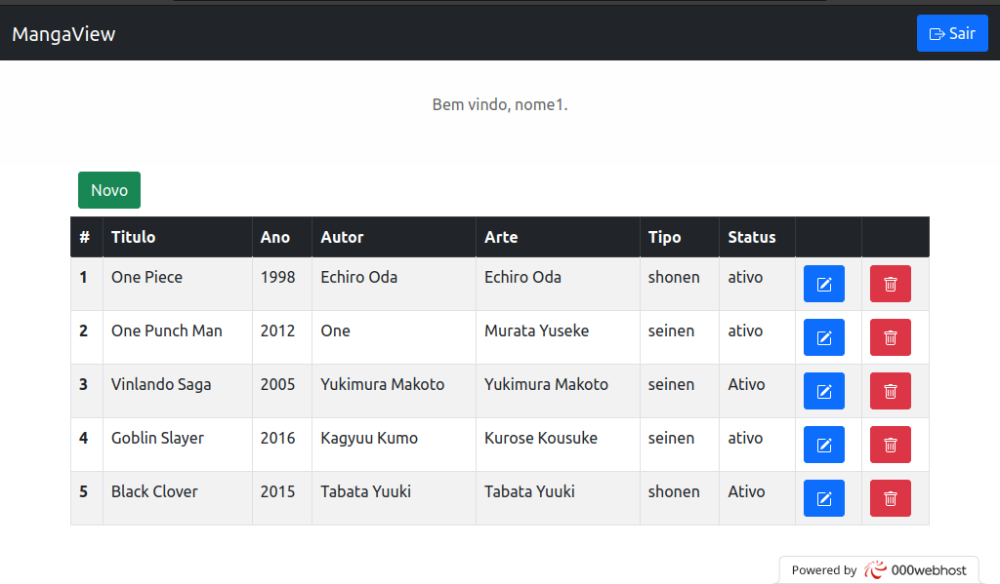
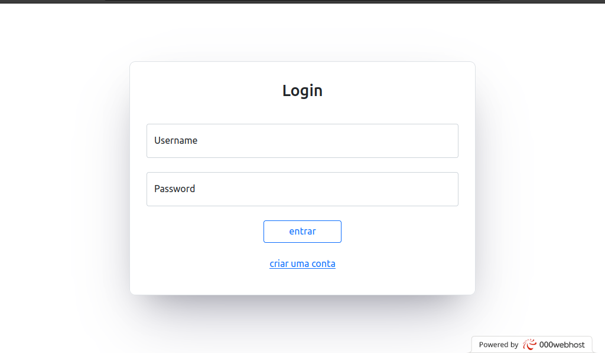

# Projeto-db_para_web

Sistema C.R.U.D para cadastro de mangás, projeto desenvolvido para a disciplina de banco de dados para web, o objetivo desse projeto era desenvolver o assunto aprendido sobre Bancos de dados SQL. 

## Imagens do projeto  
*tela principal do sistema.*

*tela de login*

## Tecnologias usados no projeto
* PHP
* HTML
* BOOTSTRAP 5
* MYSQL(SGDB) e SQL(DATABASE)

## Objetivos de atualização
* Implementar orientação a objetos no código
* Implementar arquitetura MVC
* Melhorar a segurança na inserção de dados na database

**Obs:** pretendo atualizar esse repositório a medida que avanço nos meus estudos de Back-end. 

O projeto está hospedado gratuitamento no site: 000webhost.com

**Link para o projeto em execução:** https://joaovictoralvesteste.000webhostapp.com
